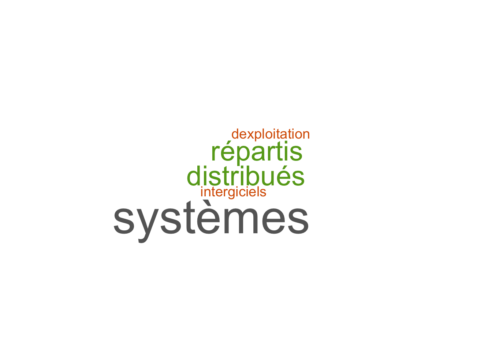

L'ACM SIGOPS France ([http://www.sigops-france.fr](ASF)) regroupe majoritairement des chercheurs et chercheuses des thématiques Systèmes informatiques et génie logiciel et programmation.

<table class="table table-striped table-hover" style="margin-left: auto; margin-right: auto;">
<tbody>
<tr>
<td style="text-align:left;">
Systèmes d'information
</td>
<td style="text-align:right;">
3
</td>
</tr>
<tr>
<td style="text-align:left;">
Algorithmique, recherche opérationnelle
</td>
<td style="text-align:right;">
2
</td>
</tr>
<tr>
<td style="text-align:left;">
Informatique fondamentale
</td>
<td style="text-align:right;">
2
</td>
</tr>
<tr>
<td style="text-align:left;">
Réseaux
</td>
<td style="text-align:right;">
3
</td>
</tr>
<tr>
<td style="text-align:left;">
Bioinformatique
</td>
<td style="text-align:right;">
0
</td>
</tr>
<tr>
<td style="text-align:left;">
<strong>Systèmes informatiques</strong>
</td>
<td style="text-align:right;">
<strong>21</strong>
</td>
</tr>
<tr>
<td style="text-align:left;">
<strong>Génie logiciel et programmation</strong>
</td>
<td style="text-align:right;">
<strong>10</strong>
</td>
</tr>
<tr>
<td style="text-align:left;">
Intelligence Artificielle
</td>
<td style="text-align:right;">
0
</td>
</tr>
<tr>
<td style="text-align:left;">
Images et géométrie, scènes, parole, signaux
</td>
<td style="text-align:right;">
0
</td>
</tr>
<tr>
<td style="text-align:left;">
Interaction humain machine
</td>
<td style="text-align:right;">
1
</td>
</tr>
<tr>
<td style="text-align:left;">
Architecture des machines
</td>
<td style="text-align:right;">
1
</td>
</tr>
<tr>
<td style="text-align:left;">
Informatique industrielle
</td>
<td style="text-align:right;">
1
</td>
</tr>
<tr>
<td style="text-align:left;">
Modélisation simulation pour les systèmes complexes, systèmes artificiels et naturels
</td>
<td style="text-align:right;">
0
</td>
</tr>
</tbody>
</table>

# Comparaison avec le comportement général

## Revue vs conférence

Pour les participants et participantes de l'ASF, l'objectif de publication en revue ou conférence est dans les deux pour 45% (contre 54% pour l'ensemble) et en revue uniquement pour 45% (contre 21%).

## Version étendue dans une revue partenaire
Pour le domaine de l'ASF, il n'est pas courant qu'une publication dans des actes d’une conférence permette un accès à la publication d’une version étendue de l’article dans une revue partenaire pour 56% des répondants et répondantes (contre 30% pour l'ensemble) et c'est une pratique courante pour 40% des répondants et répondantes de l'ASF (contre 64% dans l'ensemble).

## Classement des revues et des conférences

Dans la communauté de l'ASF, le classement australien CORE est très majoritairement utilisé. Le 'label' IEEE, ACM ou IFIP est également utilisé comme un gage de qualité.

# Analyse des canaux de publication

Les canaux considérés comme prestigieux ou recherchés correspondent très largement aux conférences et revues les mieux classées dans CORE.
Les conférences nationales (COMPAS, RESSI, Algotel) ainsi que les journées des GDR (RSD et GPL) sont considérées comme les principaux canaux d'animation de la communauté et sont particulièrement destinés aux doctorantes et doctorants.

