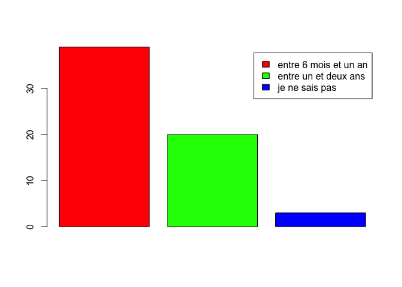

# Profil des participants
Les participants au sondage qui a permis de réaliser ce rapport se rattachent au GdR IG-RV. Ces participants se situent presque intégralement dans la section 7 du CNRS ainsi que dans le thème CNU 27 “Images et géométrie, scènes, parole, signaux”. On trouve minoritairement “Intelligence Artificielle”, “Interaction humain machine”, et “Modélisation, simulation pour les systèmes complexes, systèmes artificiels et naturels”.

<table class="table table-striped table-hover" style="margin-left: auto; margin-right: auto;">
<tbody>
<tr>
<td style="text-align:left;">
Systèmes d'information
</td>
<td style="text-align:right;">
5
</td>
</tr>
<tr>
<td style="text-align:left;">
Algorithmique, recherche opérationnelle
</td>
<td style="text-align:right;">
5
</td>
</tr>
<tr>
<td style="text-align:left;">
Informatique fondamentale
</td>
<td style="text-align:right;">
2
</td>
</tr>
<tr>
<td style="text-align:left;">
Réseaux
</td>
<td style="text-align:right;">
2
</td>
</tr>
<tr>
<td style="text-align:left;">
Bioinformatique
</td>
<td style="text-align:right;">
2
</td>
</tr>
<tr>
<td style="text-align:left;">
Systèmes informatiques
</td>
<td style="text-align:right;">
0
</td>
</tr>
<tr>
<td style="text-align:left;">
Génie logiciel et programmation
</td>
<td style="text-align:right;">
3
</td>
</tr>
<tr>
<td style="text-align:left;">
Intelligence Artificielle
</td>
<td style="text-align:right;">
5
</td>
</tr>
<tr>
<td style="text-align:left;">
Images et géométrie, scènes, parole, signaux
</td>
<td style="text-align:right;">
41
</td>
</tr>
<tr>
<td style="text-align:left;">
Interaction humain machine
</td>
<td style="text-align:right;">
15
</td>
</tr>
<tr>
<td style="text-align:left;">
Architecture des machines
</td>
<td style="text-align:right;">
0
</td>
</tr>
<tr>
<td style="text-align:left;">
Informatique industrielle 
</td>
<td style="text-align:right;">
0
</td>
</tr>
<tr>
<td style="text-align:left;">
Modélisation simulation pour les systèmes complexes, systèmes artificiels et naturels
</td>
<td style="text-align:right;">
5
</td>
</tr>
</tbody>
</table>

# Comparaison avec le comportement général (medium de publication)

La plupart des différences constatées par rapport aux pratiques moyennes de la communauté informatique sont liées à deux singularités. 

1. Les actes de certaines conférences sont publiés comme numéros spéciaux dans des revues partenaires ; en contrepartie il arrive que certains articles de revues soient invités à présenter lors de conférences. 
2. La majorité des publications concerne des travaux aboutis. Les conférences sans article, la sélection sur abstract, et la présentation de travaux en cours sont peu répandues.

Il en résulte que ce sont souvent les revues qui sont mises en avant dans le référencement et qui sont bien indexées par les indicateurs, même si une partie conséquente des publications qu’elles éditent sont issues d’actes de conférences. Les conférences sont ajoutées comme indicateur du lieu de publication pour les membres de la communauté. Par exemple, une publication à la conférence SIGGRAPH 20xx sera référencée comme : ACM Transactions on Graphics, --(--), proc. of Siggraph 20xx, et les indicateurs iront pour la revue ACM TOG.

## Revue vs Conférence

La communauté choisit de publier en très grande majorité dans des actes de conférence et en revues (réponse “les deux” du questionnaire), et dans des actes de conférences publiés par des revues. Le ciblage exlcusif vers des actes de conférence ou en revue est très minoritaire. 

## Fréquence des opportunités de publication

La fréquence des opportunités de publication est “plusieurs fois par an”.

## Version étendue en journal

Est-il courant qu’une publication dans les actes d’une conférence donne accès à une version étendue dans une revue partenaire ?
La réponse “oui”, déjà majoritaire en moyenne, est encore plus dominante ici.

## Durée du processus de publication

En cas de soumission à une revue, le temps écoulé en moyenne entre la première soumission et la publication de l’article est très majoritairement “entre 6 mois et un an”, minoritairement “entre un et deux ans”, ce qui est très significativement plus rapide que la moyenne.

## Politique de publication

### Ordre des auteurs
L’ordre des auteurs suit très majoritairement ces règles :

- Les premiers auteurs sont ceux qui ont le plus contribué.
- Les premiers auteurs sont les doctorants, suivis des encadrants, suivis des seniors porteurs de projets.
- Le premier auteur a implémenté la méthode.

La règle de l’ordre alphabétique est très peu répandue, à part entre contributeurs équivalents. 

### Mesures incitatives
On observe deux tendances allant dans le sens d’une économie des moyens financiers (voire de l’impact environnemental) :

- Limiter les déplacements aux conférences lorsqu’une publication est acceptée, en favorisant les plus réputées.
- Favoriser la publication en revue.

## Classements revues et conférences
Contrairement à la moyenne, où il est majoritairement utilisé, le classement CORE fait jeu égal avec les autres classements. Il suscite de fortes réserves, en particulier pour avoir classé très modestement des conférences et revues considérées comme de tout premier plan par la communauté. Pour les revues, l’impact factor et google scholar metrics sont très utilisés. 

## Sélection d’un canal de publication
Si les canaux les plus renommés sont préférés, ils sont souvent plus généralistes. Il est aussi fréquent de choisir une thématique ou une communauté plus restreinte, pour toucher un public plus intéressé. En particulier divers “workshop” et “symposium” associés ACM, IEEE ou EG sont très reconnus, et publient des travaux aboutis de très bonne à excellente qualité.

## Ressources ouvertes

### Dépôt
Très majoritairement, la mise en ligne sur des archives ouvertes n’est faite qu’une fois l’article final accepté. 

### Critère
L’open accès est peu privilégié (en dessous de la moyenne).

# Analyse des canaux de publication

## Canaux prestigieux

- ACM Transactions on Graphics (ToG) : revue, actes SIGGRAPH et SIGGRAPH ASIA
- IEEE Transactions on Visualisation and Computer Graphics (TVCG) : revue, actes IEEE VR journal track, actes IEEE ISMAR, actes IEEE VIS
- Computer Graphics Forum (CGF) : actes Eurographics, actes EuroVis
- IEEE Transactions on Pattern Analysis and Machine Intelligence (TPAMI)

## Canaux recherchés

- Computer Graphics Forum (CGF) : revue, actes du Symposium on Computer Animation (SCA), actes Eurographics Symposium on Rendering (EGSR), actes du Symposium on Geometry Processing (SGP), actes - Pacific Graphics (PG), actes High Performance Graphics (HPG)
- Computer Aided Design (CAD)
- Computer Aided Geometric Design (CAGD)
- Computer and Graphics (C&G) : revue et actes de Shape Modelling International (SMI)
- IEEE Computer Graphics and Application (IEEE CG&A)
- Symposium on Solid and Physical Modeling (SPM)
- International Conference on Geometric Modeling Processing (GMP)
- Journal of Mathematical Imaging and Vision
- Discrete Applied Mathematics
- IEEE Pacific Visualization Symposium (PacificVis) 
- IEEE Symposium on Large Data Analysis and Visualization (LDAV)
- ACM Symposium on User Interface Software and Technology (UIST)
- The ACM Symposium on Virtual Reality Software and Technology (VRST)
- ACM SIGGRAPH Symposium on Interactive 3D Graphics and Games (ACM I3D)
- IEEE VR conference track
- Conference on Human Factors in Computing Systems (CHI)
- IEEE/RSJ International Conference on Intelligent Robots and Systems (IROS)
- IEEE International Conference on Robotics and Automation (ICRA)
- ACM Transactions on Applied Perception (TAP)
- Frontiers in Robotics and AI

## Canaux de qualité

- The Visual Computer (TVC)
- Graphical Models (GMOD)
- Computer Graphics International (CGI)
- EXPRESSIVE Symposium
- Motion in Games (MiG)
- ACM Symposium on Applied Perception (SAP)
- Graphics Interface (GI)
- Journal of Computer Graphics Techniques (JCGT)
- Workshop 3D Object Retrieval (3DOR)
- International Symposium on Mouvement and Computing (MOCO)
- International Conference 3D Digital Imaging and Modeling (3DIM)
- International Conference on Computer Graphics Theory and Applications (GRAPP)
- International Conference on Human Computer Interaction Theory and Applications (HUCAPP)
- International Conference on Computational Photography (ICCP)
- International Conference on Computer Animation and Social Agents (CASA)
- Computer Animation and Virtual Worlds Journal (CAVW)
- Vision Modeling and Visualization (VMV)
- Pattern Recognition
- Pattern Recognition Letters
- International Conference on 3D Vision (3DV) 
- Springer Machine Vision and Applications
- Springer Virtual Reality
- PRESENCE: Virtual and Augmented Reality

## Canaux accessibles

- Journées Françaises d’Informatique Graphique (jFIG)
- Journées du GdR IGRV
- Journées de l’AFRV
- Conférence Francophone sur l’Interaction Homme-Machine (IHM)
- Virtual Reality International Conference - Laval Virtual (VRIC)
- Spring Conference on Computer Graphics (SCCG)
- World Society for Computer Graphics (WSCG) : International Conferences in Central Europe on Computer Graphics, Visualization and Computer Vision
- ACM SIGGRAPH European Conference on Visual Media Production
- Discrete Geometry for Computer Imagery
