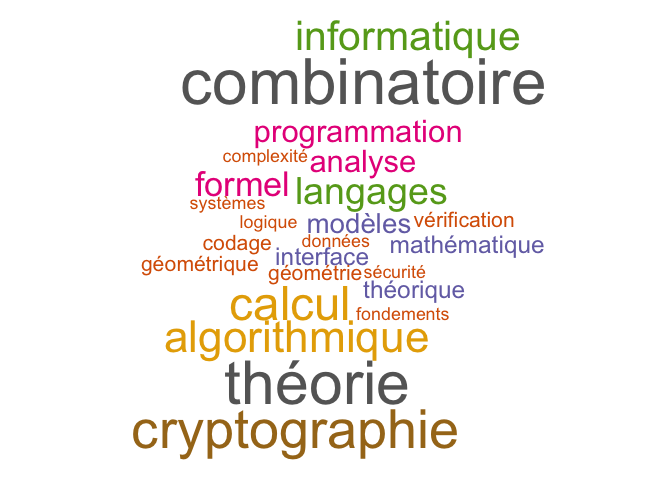
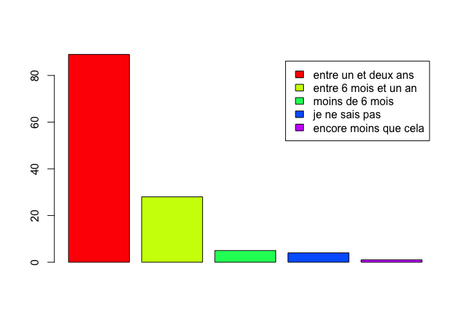
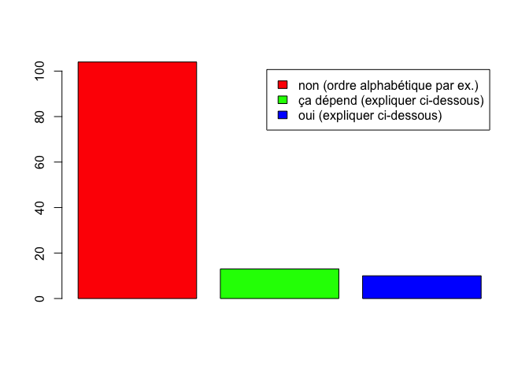
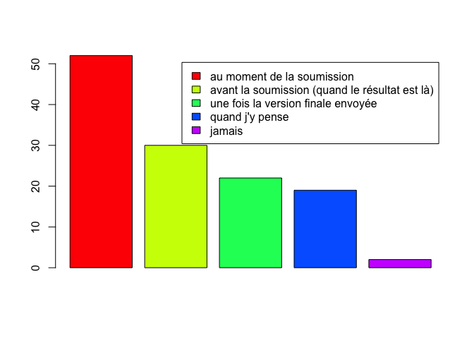

Le GDR IM regroupe majoritairement des chercheurs de la thématique Algorithmique, recherche opérationnelle et des chercheurs d'informatique fondamentale.

<table class="table table-striped table-hover" style="margin-left: auto; margin-right: auto;">
<tbody>
<tr>
<td style="text-align:left;">
Systèmes d'information
</td>
<td style="text-align:right;">
7
</td>
</tr>
<tr>
<td style="text-align:left;">
<strong>Algorithmique, recherche opérationnelle</strong>
</td>
<td style="text-align:right;">
<strong>47</strong>
</td>
</tr>
<tr>
<td style="text-align:left;">
<strong>Informatique fondamentale</strong>
</td>
<td style="text-align:right;">
<strong>87</strong>
</td>
</tr>
<tr>
<td style="text-align:left;">
Réseaux
</td>
<td style="text-align:right;">
2
</td>
</tr>
<tr>
<td style="text-align:left;">
Bioinformatique
</td>
<td style="text-align:right;">
9
</td>
</tr>
<tr>
<td style="text-align:left;">
Systèmes informatiques
</td>
<td style="text-align:right;">
3
</td>
</tr>
<tr>
<td style="text-align:left;">
Génie logiciel et programmation
</td>
<td style="text-align:right;">
6
</td>
</tr>
<tr>
<td style="text-align:left;">
Intelligence Artificielle
</td>
<td style="text-align:right;">
10
</td>
</tr>
<tr>
<td style="text-align:left;">
Images et géométrie, scènes, parole, signaux
</td>
<td style="text-align:right;">
8
</td>
</tr>
<tr>
<td style="text-align:left;">
Interaction humain machine
</td>
<td style="text-align:right;">
0
</td>
</tr>
<tr>
<td style="text-align:left;">
Architecture des machines
</td>
<td style="text-align:right;">
2
</td>
</tr>
<tr>
<td style="text-align:left;">
Informatique industrielle
</td>
<td style="text-align:right;">
0
</td>
</tr>
<tr>
<td style="text-align:left;">
Modélisation simulation pour les systèmes complexes, systèmes artificiels et naturels
</td>
<td style="text-align:right;">
5
</td>
</tr>
</tbody>
</table>

# Comparaison avec le comportement général

## Durée du processus de publication en revue

On note que pour le GDR IM, 75% du cycle de publication est supérieur à 1 an (contre 56% dans les réponses globales).

## Ordre des auteurs

L'ordre des auteurs est presque toujours l'ordre alphabétique sur les publications. Cela explique au niveau
thématique la singularité de l'Algorithmique, recherche opérationnelle et de l'informatique fondamentale par rapport aux autres thématiques.

## Classement des revues et des conférences

27% répondent « autre » et beaucoup expriment leur opposition dans les réponses ouvertes (contre 9,5% de « autre » globalement)

<table class="table table-striped table-hover" style="margin-left: auto; margin-right: auto;">
<tbody>
<tr>
<td style="text-align:left;">
CORE
</td>
<td style="text-align:right;">
36
</td>
</tr>
<tr>
<td style="text-align:left;">
Scimago
</td>
<td style="text-align:right;">
10
</td>
</tr>
<tr>
<td style="text-align:left;">
Scopus ou équivalent, Thomson Reuters
</td>
<td style="text-align:right;">
2
</td>
</tr>
<tr>
<td style="text-align:left;">
Google scholar
</td>
<td style="text-align:right;">
14
</td>
</tr>
<tr>
<td style="text-align:left;">
Autre
</td>
<td style="text-align:right;">
24
</td>
</tr>
</tbody>
</table>

## Archives ouvertes

70% pré-publient en archive ouverte avant ou au moment de la
soumission (contre 30% globalement)

# Analyse des canaux de publication

Les canaux considérés comme prestigieux ou recherchés sont extrêmement
variés. Selon les communautés, on y trouve :

- des conférences d'informatique généralistes (ex : STOC),
- des journaux d'informatique généralistes (ex: Journal of the ACM),
- des journaux de mathématiques généralistes (ex: Annals of Maths),
- des journaux de science généralistes (ex : Nature),
- de nombreux canaux plus spécialisés, que ce soit des conférences (ex : CRYPTO), des journaux d'informatique (ex : ACM TOG) ou des journaux de mathématiques (ex : Annals of probability).

L'attribution d'un même canal aux différents niveaux de prestige
(prestigieux/recherché/de qualité) varie selon les réponses, en
particulier pour les canaux généralistes.

L'existence de canaux à destination des doctorants n'est pas claire :
beaucoup de réponses mentionnent les même canaux que dans le cas
général, ou évoquent des ateliers (internationaux ou français) ou
groupes de travail de GDR qui sont repris dans les exemples de canaux
d'animation.

De nombreuses réponses dans la rubrique "remarques complémentaires"
expriment une méfiance voire un refus des classements de canaux de
publication.
