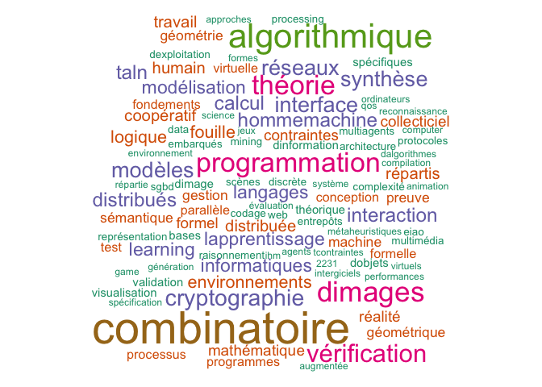

# Objectifs

Le but de ce référentiel est de cartographier les pratiques
de publication des enseignants-chercheurs et chercheurs en
informatique de France à partir des réponses à un sondage
qui a eu lieu entre octobre 2018 et février 2019.

Ce sondage a été élaboré par le conseil des associations des la SIF, suite à des discussions sur la diversité des pratiques de publication au sein même de la discipline informatique.

Le référentiel a pour but de rendre publique des pratiques de publications connues des communautés thématiques mais pas forcément de l'ensemble de la communauté informatique.

Le document a vocation à évoluer au cours du temps.

Il se décline en deux parties. Une analyse globale des pratiques de publication de la discipline informatique (ce document) et une analyse plus détaillée par thématique opérée par les associations thématiques ou GDR.

Les scripts ayant servi à l'analyse des réponses sont [disponibles pour information et vérification](../scripts).

# Profil des participants au sondage

Au 10 février 2019, il y a eu 689 réponses au total dont 663 uniques après traitement des réponses pour enlever les doublons, probablement dûs à des envois répétés du même formulaire.

## Thématiques de recherche

Les participants devaient se positionner dans [l'une des 13 catégories de la nomenclature CNU 27](http://cnu27.iut2.upmf-grenoble.fr/Qualifications/Nomenclature-2013.html).

<table class="table table-striped table-hover" style="margin-left: auto; margin-right: auto;">

<tbody>

<tr><td style="text-align:left;">Systèmes d'information</td><td style="text-align:right;">83</td></tr>

<tr><td style="text-align:left;"><strong>Algorithmique, recherche opérationnelle</strong></td><td style="text-align:right;"><strong>166</strong></td></tr>

<tr><td style="text-align:left;"><strong>Informatique fondamentale</strong></td><td style="text-align:right;"><strong>152</strong></td></tr>

<tr><td style="text-align:left;">Réseaux</td><td style="text-align:right;">40</td></tr>

<tr><td style="text-align:left;">Bioinformatique</td><td style="text-align:right;">27</td></tr>

<tr><td style="text-align:left;">Systèmes informatiques</td><td style="text-align:right;">64</td></tr>

<tr><td style="text-align:left;">Génie logiciel et programmation</td><td style="text-align:right;">76</td></tr>

<tr><td style="text-align:left;"><strong>Intelligence Artificielle</strong></td><td style="text-align:right;"><strong>155</strong></td></tr>

<tr><td style="text-align:left;">Images et géométrie, scènes, parole, signaux</td><td style="text-align:right;">92</td></tr>

<tr><td style="text-align:left;"><strong>Interaction humain machine</strong></td><td style="text-align:right;"><strong>112</strong></td></tr>

<tr><td style="text-align:left;">Architecture des machines</td><td style="text-align:right;">16</td></tr>

<tr><td style="text-align:left;">Informatique industrielle</td><td style="text-align:right;">11</td></tr>

<tr><td style="text-align:left;">Modélisation-simulation pour les systèmes complexes (systèmes artificiels et naturels) </td><td style="text-align:right;">47</td></tr>

</tbody>
</table>

On note que plusieurs thématiques sont couvertes par plus de 150 réponses (Algorithmique/RO, Informatique Fondamentale et Intelligence Artificielle), ce qui en fait les thématiques les plus représentées parmi les répondants.

Cela est cohérent avec les statistiques des demandes de qualification aux fonctions de [maître de conférences](http://cnu27.iut2.upmf-grenoble.fr/Qualifications/2019/web-stats-mc-site-public-2019.pdf) ou de [professeur des universités](http://cnu27.iut2.upmf-grenoble.fr/Qualifications/2019/web-stats-pr-site-public-2019.pdf) de la section 27 du CNU. La communauté Interaction humain-machine s'est particulièrement mobilisé pour ce questionnaire.

Il était aussi possible de compléter cette nomenclature en indiquant dans un champs texte libre sa thématique de recherche.
Le nuage de mots suivant résume les informations soumises par ce biais.

Une autre information importante est l'expérience du chercheur dans ce domaine.

Avec une expérience médiane de 15 années, la moitié des réponses qui indiquent entre 10 et 20 années d'expérience, les participants sont plutôt des chercheurs confirmés. On ne note pas de différence thématique significative, si ce n'est que l'expérience médiane parmi les réponses venant d'informatique théorique (GDR IM) est de 13 années alors que l'expérience médiane des réponses provenant des adhérents de la SIF est de 20 années.

## Associations

Le sondage a été diffusé par les associations du conseil des associations de la SIF.
La table suivante indique pour les réponses obtenues le nombre de réponses à l'appel de chaque association.

<table class="table table-striped table-hover" style="margin-left: auto; margin-right: auto;">

<tbody>

<tr><td style="text-align:left;">ACM SIGGRAPH France</td><td style="text-align:right;">1</td></tr>

<tr><td style="text-align:left;">AFIA</td><td style="text-align:right;">11</td></tr>

<tr><td style="text-align:left;">AFIG</td><td style="text-align:right;">47</td></tr>

<tr><td style="text-align:left;">AFIHM</td><td style="text-align:right;">52</td></tr>

<tr><td style="text-align:left;">AFPC</td><td style="text-align:right;">13</td></tr>

<tr><td style="text-align:left;">ARIA</td><td style="text-align:right;">3</td></tr>

<tr><td style="text-align:left;">ASF</td><td style="text-align:right;">25</td></tr>

<tr><td style="text-align:left;">ATALA</td><td style="text-align:right;">13</td></tr>

<tr><td style="text-align:left;">ATIEF</td><td style="text-align:right;">26</td></tr>

<tr><td style="text-align:left;">BDA</td><td style="text-align:right;">4</td></tr>

<tr><td style="text-align:left;">EGC</td><td style="text-align:right;">24</td></tr>

<tr><td style="text-align:left;">GDR IG RV</td><td style="text-align:right;">61</td></tr>

<tr><td style="text-align:left;"><strong>GDR IM</strong></td><td style="text-align:right;"><strong>127</strong></td></tr>

<tr><td style="text-align:left;">GRCE</td><td style="text-align:right;">9</td></tr>

<tr><td style="text-align:left;">INFORSID</td><td style="text-align:right;">22</td></tr>

<tr><td style="text-align:left;">ROADEF</td><td style="text-align:right;">64</td></tr>

<tr><td style="text-align:left;"><strong>SIF</strong></td><td style="text-align:right;"><strong>144</strong></td></tr>

<tr><td style="text-align:left;">SPECIF Campus</td><td style="text-align:right;">8</td></tr>

<tr><td style="text-align:left;">SSFAM</td><td style="text-align:right;">17</td></tr>

<tr><td style="text-align:left;">autre</td><td style="text-align:right;">97</td></tr>

</tbody>

</table>

La SIF et le GDR IM sont à l'origine de plus d'un tiers des réponses. Une centaine de réponses
viennent d'autres associations ou GDR.

Si ces résultats sont cohérents avec la répartition par thématiques pour la RO (ROADEF) et l'informatique fondamentale (GDR IM), on ne retrouve pas le grand nombre de réponses en intelligence artificielle dans l'AFIA ou AFPC.

# Medium de publication

## Revue vs conférence

On entend souvent dire que les informaticiens publient plutôt dans des actes de conférences que dans des revues,
que c'est une spécificité de la communauté.

Nous avons posé la question « Votre objectif est de publier vos résultats plutôt en revue ou dans des actes de conférence ? ».

La réponse est très claire : la majorité des réponses considère à la fois les revues et les conférences comme objectif de publication. On note cependant des différences de pratiques selon les thématiques.

<table class="table table-striped table-hover" style="margin-left: auto; margin-right: auto;">
<thead>
<tr>
<th style="text-align:left;">
</th>
<th style="text-align:right;">
dans des actes de conférence
</th>
<th style="text-align:right;">
dans les deux
</th>
<th style="text-align:right;">
en revue
</th>
<th style="text-align:right;">
je ne sais pas
</th>
<th style="text-align:right;">
mes actes de conférences sont publiés par des revues !
</th>
</tr>
</thead>
<tbody>
<tr>
<td style="text-align:left;">
<strong>Algorithmique,recherche opérationnelle</strong>
</td>
<td style="text-align:right;">
10
</td>
<td style="text-align:right;">
<strong>78</strong>
</td>
<td style="text-align:right;">
<strong>68</strong>
</td>
<td style="text-align:right;">
2
</td>
<td style="text-align:right;">
1
</td>
</tr>
<tr>
<td style="text-align:left;">
Architecture des machines
</td>
<td style="text-align:right;">
0
</td>
<td style="text-align:right;">
1
</td>
<td style="text-align:right;">
1
</td>
<td style="text-align:right;">
0
</td>
<td style="text-align:right;">
0
</td>
</tr>
<tr>
<td style="text-align:left;">
Bioinformatique
</td>
<td style="text-align:right;">
0
</td>
<td style="text-align:right;">
7
</td>
<td style="text-align:right;">
2
</td>
<td style="text-align:right;">
0
</td>
<td style="text-align:right;">
0
</td>
</tr>
<tr>
<td style="text-align:left;">
Génie logiciel et programmation
</td>
<td style="text-align:right;">
3
</td>
<td style="text-align:right;">
12
</td>
<td style="text-align:right;">
4
</td>
<td style="text-align:right;">
1
</td>
<td style="text-align:right;">
2
</td>
</tr>
<tr>
<td style="text-align:left;">
<strong>Images et géométrie,scènes, parole, signaux</strong>
</td>
<td style="text-align:right;">
3
</td>
<td style="text-align:right;">
34
</td>
<td style="text-align:right;">
9
</td>
<td style="text-align:right;">
0
</td>
<td style="text-align:right;">
<strong>19</strong>
</td>
</tr>
<tr>
<td style="text-align:left;">
Informatique fondamentale
</td>
<td style="text-align:right;">
20
</td>
<td style="text-align:right;">
47
</td>
<td style="text-align:right;">
18
</td>
<td style="text-align:right;">
3
</td>
<td style="text-align:right;">
5
</td>
</tr>
<tr>
<td style="text-align:left;">
Informatique industrielle
</td>
<td style="text-align:right;">
0
</td>
<td style="text-align:right;">
1
</td>
<td style="text-align:right;">
0
</td>
<td style="text-align:right;">
0
</td>
<td style="text-align:right;">
0
</td>
</tr>
<tr>
<td style="text-align:left;">
Intelligence Artificielle
</td>
<td style="text-align:right;">
28
</td>
<td style="text-align:right;">
50
</td>
<td style="text-align:right;">
9
</td>
<td style="text-align:right;">
0
</td>
<td style="text-align:right;">
5
</td>
</tr>
<tr>
<td style="text-align:left;">
Interaction humain machine
</td>
<td style="text-align:right;">
22
</td>
<td style="text-align:right;">
41
</td>
<td style="text-align:right;">
8
</td>
<td style="text-align:right;">
0
</td>
<td style="text-align:right;">
4
</td>
</tr>
<tr>
<td style="text-align:left;">
Modélisation simulation pour les systèmes complexes, systèmes artificiels et naturels
</td>
<td style="text-align:right;">
0
</td>
<td style="text-align:right;">
1
</td>
<td style="text-align:right;">
1
</td>
<td style="text-align:right;">
1
</td>
<td style="text-align:right;">
0
</td>
</tr>
<tr>
<td style="text-align:left;">
Réseaux
</td>
<td style="text-align:right;">
5
</td>
<td style="text-align:right;">
17
</td>
<td style="text-align:right;">
5
</td>
<td style="text-align:right;">
0
</td>
<td style="text-align:right;">
0
</td>
</tr>
<tr>
<td style="text-align:left;">
Systèmes d'information
</td>
<td style="text-align:right;">
17
</td>
<td style="text-align:right;">
54
</td>
<td style="text-align:right;">
13
</td>
<td style="text-align:right;">
1
</td>
<td style="text-align:right;">
2
</td>
</tr>
<tr>
<td style="text-align:left;">
Systèmes informatiques
</td>
<td style="text-align:right;">
14
</td>
<td style="text-align:right;">
17
</td>
<td style="text-align:right;">
2
</td>
<td style="text-align:right;">
0
</td>
<td style="text-align:right;">
0
</td>
</tr>
</tbody>
</table>

En Algorithmique et Recherche Opérationnelle, l'objectif de publication en revue est plus important que dans les autres disciplines. En Images et géométrie, scènes, parole, signaux on note un nombre significatif de réponses indiquant que les actes de conférences sont publiés par des revues.

## Fréquence des opportunités de publication dans des conférences de bonne qualité

On a vu le nombre de conférences augmenter significativement durant ces deux dernières décennies, notamment du fait de la dématérialisation des soumissions et du travail du comité de programme.
Par conséquent, dans toutes les thématiques, il est possible de trouver une ou plusieurs conférences de qualité à laquelle soumettre son travail dans l'année.

## Version étendue dans une revue partenaire

A la question « Est il courant dans votre domaine qu’une publication dans des actes d’une conférence permette un accès à la publication d’une version étendue de l’article dans une revue partenaire ? », la majorité répond par l'affirmative.

On note cependant qu'en Intelligence Artificielle et en Interaction Humain Machine, cette pratique ne semble 
pas systématique (il y a presque autant de réponses négatives que positives dans ces thématiques).

<table class="table table-striped table-hover" style="margin-left: auto; margin-right: auto;">
<thead>
<tr>
<th style="text-align:left;">
</th>
<th style="text-align:right;">
je ne sais pas
</th>
<th style="text-align:right;">
non
</th>
<th style="text-align:right;">
oui
</th>
</tr>
</thead>
<tbody>
<tr>
<td style="text-align:left;">
Algorithmique, recherche opérationnelle
</td>
<td style="text-align:right;">
12
</td>
<td style="text-align:right;">
32
</td>
<td style="text-align:right;">
114
</td>
</tr>
<tr>
<td style="text-align:left;">
Architecture des machines
</td>
<td style="text-align:right;">
0
</td>
<td style="text-align:right;">
1
</td>
<td style="text-align:right;">
1
</td>
</tr>
<tr>
<td style="text-align:left;">
Bioinformatique
</td>
<td style="text-align:right;">
1
</td>
<td style="text-align:right;">
0
</td>
<td style="text-align:right;">
8
</td>
</tr>
<tr>
<td style="text-align:left;">
Génie logiciel et programmation
</td>
<td style="text-align:right;">
2
</td>
<td style="text-align:right;">
7
</td>
<td style="text-align:right;">
13
</td>
</tr>
<tr>
<td style="text-align:left;">
Images et géométrie, scènes, parole, signaux
</td>
<td style="text-align:right;">
2
</td>
<td style="text-align:right;">
15
</td>
<td style="text-align:right;">
48
</td>
</tr>
<tr>
<td style="text-align:left;">
Informatique fondamentale
</td>
<td style="text-align:right;">
8
</td>
<td style="text-align:right;">
19
</td>
<td style="text-align:right;">
66
</td>
</tr>
<tr>
<td style="text-align:left;">
Informatique industrielle
</td>
<td style="text-align:right;">
0
</td>
<td style="text-align:right;">
1
</td>
<td style="text-align:right;">
0
</td>
</tr>
<tr>
<td style="text-align:left;">
<strong>Intelligence Artificielle</strong>
</td>
<td style="text-align:right;">
2
</td>
<td style="text-align:right;">
<strong>43</strong>
</td>
<td style="text-align:right;">
<strong>47</strong>
</td>
</tr>
<tr>
<td style="text-align:left;">
<strong>Interaction humain machine</strong>
</td>
<td style="text-align:right;">
5
</td>
<td style="text-align:right;">
<strong>33</strong>
</td>
<td style="text-align:right;">
<strong>36</strong>
</td>
</tr>
<tr>
<td style="text-align:left;">
Modélisation simulation pour les systèmes complexes, systèmes artificiels et naturels
</td>
<td style="text-align:right;">
1
</td>
<td style="text-align:right;">
1
</td>
<td style="text-align:right;">
1
</td>
</tr>
<tr>
<td style="text-align:left;">
Réseaux
</td>
<td style="text-align:right;">
1
</td>
<td style="text-align:right;">
9
</td>
<td style="text-align:right;">
17
</td>
</tr>
<tr>
<td style="text-align:left;">
Systèmes d'information
</td>
<td style="text-align:right;">
5
</td>
<td style="text-align:right;">
21
</td>
<td style="text-align:right;">
62
</td>
</tr>
<tr>
<td style="text-align:left;">
Systèmes informatiques
</td>
<td style="text-align:right;">
1
</td>
<td style="text-align:right;">
14
</td>
<td style="text-align:right;">
19
</td>
</tr>
</tbody>
</table>

## Durée du processus de publication en revue

Un des arguments pour la publication dans des actes de conférences est la rapidité du processus de publication : il se déroule généralement entre 6 et 9 mois entre la soumission d'un article et sa présentation à la conférence en cas d'acceptation.

Nous avons demandé quel était généralement la durée observée pour la publication d'un article dans une revue.

Dans l'ensemble, la durée du processus de publication dans une revue est d'un à deux ans. Il ne semble pas y avoir de corrélation entre la durée de publication et le choix de publier en revue.

En effet, une communauté comme la recherche opérationnelle qui publie beaucoup en revue a une durée du processus de publication de un à deux ans.
Par contre, des thématiques comme l'intelligence artificielle et l'interaction humain machine qui ont une pratique de publication en conférences importante ont aussi des durées de publication en revue comparables à ceux d'une conférence.

<table class="table table-striped table-hover" style="margin-left: auto; margin-right: auto;">
<thead>
<tr>
<th style="text-align:left;">
</th>
<th style="text-align:right;">
encore moins que cela
</th>
<th style="text-align:right;">
entre 6 mois et un an
</th>
<th style="text-align:right;">
entre un et deux ans
</th>
<th style="text-align:right;">
je ne sais pas
</th>
<th style="text-align:right;">
moins de 6 mois
</th>
</tr>
</thead>
<tbody>
<tr>
<td style="text-align:left;">
<strong>Algorithmique, recherche opérationnelle</strong>
</td>
<td style="text-align:right;">
2
</td>
<td style="text-align:right;">
37
</td>
<td style="text-align:right;">
<strong>113</strong>
</td>
<td style="text-align:right;">
6
</td>
<td style="text-align:right;">
1
</td>
</tr>
<tr>
<td style="text-align:left;">
Architecture des machines
</td>
<td style="text-align:right;">
0
</td>
<td style="text-align:right;">
0
</td>
<td style="text-align:right;">
2
</td>
<td style="text-align:right;">
0
</td>
<td style="text-align:right;">
0
</td>
</tr>
<tr>
<td style="text-align:left;">
Bioinformatique
</td>
<td style="text-align:right;">
0
</td>
<td style="text-align:right;">
5
</td>
<td style="text-align:right;">
1
</td>
<td style="text-align:right;">
0
</td>
<td style="text-align:right;">
3
</td>
</tr>
<tr>
<td style="text-align:left;">
Génie logiciel et programmation
</td>
<td style="text-align:right;">
0
</td>
<td style="text-align:right;">
9
</td>
<td style="text-align:right;">
12
</td>
<td style="text-align:right;">
1
</td>
<td style="text-align:right;">
0
</td>
</tr>
<tr>
<td style="text-align:left;">
<strong>Images et géométrie, scènes, parole, signaux</strong>
</td>
<td style="text-align:right;">
0
</td>
<td style="text-align:right;">
<strong>42</strong>
</td>
<td style="text-align:right;">
<strong>17</strong>
</td>
<td style="text-align:right;">
2
</td>
<td style="text-align:right;">
4
</td>
</tr>
<tr>
<td style="text-align:left;">
Informatique fondamentale
</td>
<td style="text-align:right;">
0
</td>
<td style="text-align:right;">
27
</td>
<td style="text-align:right;">
59
</td>
<td style="text-align:right;">
2
</td>
<td style="text-align:right;">
4
</td>
</tr>
<tr>
<td style="text-align:left;">
Informatique industrielle
</td>
<td style="text-align:right;">
0
</td>
<td style="text-align:right;">
0
</td>
<td style="text-align:right;">
1
</td>
<td style="text-align:right;">
0
</td>
<td style="text-align:right;">
0
</td>
</tr>
<tr>
<td style="text-align:left;">
<strong>Intelligence Artificielle</strong>
</td>
<td style="text-align:right;">
1
</td>
<td style="text-align:right;">
<strong>52</strong>
</td>
<td style="text-align:right;">
<strong>33</strong>
</td>
<td style="text-align:right;">
2
</td>
<td style="text-align:right;">
3
</td>
</tr>
<tr>
<td style="text-align:left;">
<strong>Interaction humain machine</strong>
</td>
<td style="text-align:right;">
0
</td>
<td style="text-align:right;">
<strong>39</strong>
</td>
<td style="text-align:right;">
<strong>24</strong>
</td>
<td style="text-align:right;">
7
</td>
<td style="text-align:right;">
5
</td>
</tr>
<tr>
<td style="text-align:left;">
Modélisation simulation pour les systèmes complexes, systèmes artificiels et naturels
</td>
<td style="text-align:right;">
1
</td>
<td style="text-align:right;">
0
</td>
<td style="text-align:right;">
1
</td>
<td style="text-align:right;">
1
</td>
<td style="text-align:right;">
0
</td>
</tr>
<tr>
<td style="text-align:left;">
Réseaux
</td>
<td style="text-align:right;">
0
</td>
<td style="text-align:right;">
10
</td>
<td style="text-align:right;">
14
</td>
<td style="text-align:right;">
1
</td>
<td style="text-align:right;">
2
</td>
</tr>
<tr>
<td style="text-align:left;">
Systèmes d'information
</td>
<td style="text-align:right;">
0
</td>
<td style="text-align:right;">
36
</td>
<td style="text-align:right;">
44
</td>
<td style="text-align:right;">
5
</td>
<td style="text-align:right;">
1
</td>
</tr>
<tr>
<td style="text-align:left;">
Systèmes informatiques
</td>
<td style="text-align:right;">
0
</td>
<td style="text-align:right;">
13
</td>
<td style="text-align:right;">
19
</td>
<td style="text-align:right;">
1
</td>
<td style="text-align:right;">
1
</td>
</tr>
</tbody>
</table>

> Hypothèse : l'existence d'une pratique de publication en conférences importante a poussé les revues à réduire leurs délais de publication pour rester attractives.

Concernant le cas de la thématique Image,
le délai réduit pour la publication en revue est sans doute une conséquence de la publication d'actes de conférences en revue.

# Politique de publication

## Ordre des auteurs

La sémantique de l'ordre des auteurs varie selon les communautés.
Dans les pays anglo-saxons, la notion de premier auteur est importante.
Si celui-ci est étudiant, il peut concourir aux prix du meilleur papier étudiant par exemple.

Dans l'ensemble, l'ordre des auteurs est important.

Cependant, la sémantique varie : le premier auteur peut être le doctorant, postdoctorant ou le principal contributeur, le dernier auteur peut être le directeur de thèse, le responsable du financement. Globalement, l'ordre des auteurs révèle dans ce cadre une contribution décroissante au travail, avec des interprétations diverses pour le dernier auteur.

Il est intéressant de noter que les pratiques divergent selon les thématiques.

<table class="table table-striped table-hover" style="margin-left: auto; margin-right: auto;">
<thead>
<tr>
<th style="text-align:left;">
</th>
<th style="text-align:right;">
ça dépend (expliquer ci-dessous)
</th>
<th style="text-align:right;">
je ne sais pas
</th>
<th style="text-align:right;">
non (ordre alphabétique par ex.)
</th>
<th style="text-align:right;">
oui (expliquer ci-dessous)
</th>
</tr>
</thead>
<tbody>
<tr>
<td style="text-align:left;">
<strong>Algorithmique, recherche opérationnelle</strong>
</td>
<td style="text-align:right;">
<strong>32</strong>
</td>
<td style="text-align:right;">
5
</td>
<td style="text-align:right;">
<strong>84</strong>
</td>
<td style="text-align:right;">
36
</td>
</tr>
<tr>
<td style="text-align:left;">
Architecture des machines
</td>
<td style="text-align:right;">
0
</td>
<td style="text-align:right;">
0
</td>
<td style="text-align:right;">
0
</td>
<td style="text-align:right;">
2
</td>
</tr>
<tr>
<td style="text-align:left;">
Bioinformatique
</td>
<td style="text-align:right;">
1
</td>
<td style="text-align:right;">
0
</td>
<td style="text-align:right;">
1
</td>
<td style="text-align:right;">
7
</td>
</tr>
<tr>
<td style="text-align:left;">
Génie logiciel et programmation
</td>
<td style="text-align:right;">
3
</td>
<td style="text-align:right;">
0
</td>
<td style="text-align:right;">
5
</td>
<td style="text-align:right;">
<strong>14</strong>
</td>
</tr>
<tr>
<td style="text-align:left;">
Images et géométrie,scènes, parole, signaux
</td>
<td style="text-align:right;">
4
</td>
<td style="text-align:right;">
3
</td>
<td style="text-align:right;">
4
</td>
<td style="text-align:right;">
<strong>54</strong>
</td>
</tr>
<tr>
<td style="text-align:left;">
<strong>Informatique fondamentale</strong>
</td>
<td style="text-align:right;">
14
</td>
<td style="text-align:right;">
0
</td>
<td style="text-align:right;">
<strong>76</strong>
</td>
<td style="text-align:right;">
3
</td>
</tr>
<tr>
<td style="text-align:left;">
Informatique industrielle
</td>
<td style="text-align:right;">
0
</td>
<td style="text-align:right;">
0
</td>
<td style="text-align:right;">
0
</td>
<td style="text-align:right;">
1
</td>
</tr>
<tr>
<td style="text-align:left;">
Intelligence Artificielle
</td>
<td style="text-align:right;">
<strong>26</strong>
</td>
<td style="text-align:right;">
0
</td>
<td style="text-align:right;">
11
</td>
<td style="text-align:right;">
<strong>55</strong>
</td>
</tr>
<tr>
<td style="text-align:left;">
Interaction humain machine
</td>
<td style="text-align:right;">
10
</td>
<td style="text-align:right;">
0
</td>
<td style="text-align:right;">
4
</td>
<td style="text-align:right;">
<strong>61</strong>
</td>
</tr>
<tr>
<td style="text-align:left;">
Modélisation simulation pour les systèmes complexes,  systèmes artificiels et naturels
</td>
<td style="text-align:right;">
0
</td>
<td style="text-align:right;">
1
</td>
<td style="text-align:right;">
0
</td>
<td style="text-align:right;">
2
</td>
</tr>
<tr>
<td style="text-align:left;">
Réseaux
</td>
<td style="text-align:right;">
2
</td>
<td style="text-align:right;">
0
</td>
<td style="text-align:right;">
4
</td>
<td style="text-align:right;">
<strong>21</strong>
</td>
</tr>
<tr>
<td style="text-align:left;">
Systèmes d'information
</td>
<td style="text-align:right;">
<strong>27</strong>
</td>
<td style="text-align:right;">
3
</td>
<td style="text-align:right;">
16
</td>
<td style="text-align:right;">
<strong>40</strong>
</td>
</tr>
<tr>
<td style="text-align:left;">
Systèmes informatiques
</td>
<td style="text-align:right;">
6
</td>
<td style="text-align:right;">
1
</td>
<td style="text-align:right;">
5
</td>
<td style="text-align:right;">
<strong>22</strong>
</td>
</tr>
</tbody>
</table>

En informatique fondamentale, l'ordre alphabétique semble le plus couramment utilisé. C'est aussi le cas en Algorithmique et recherche opérationnelle, même si l'on note un fort nombre de réponses indiquant que la pratique peut varier selon les situations et un nombre équivalent de réponses indiquant que l'ordre est important.

Dans les autres cas, la sémantique est importante. On note cependant que pour l'Intelligence Artificielle et les Systèmes d'information, la pratique est moins tranchée.