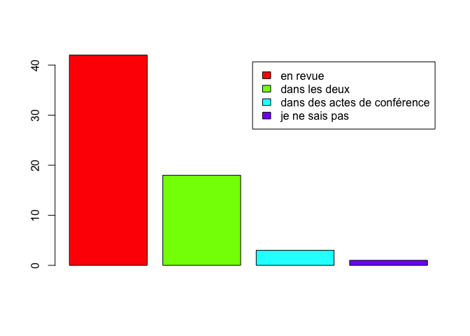
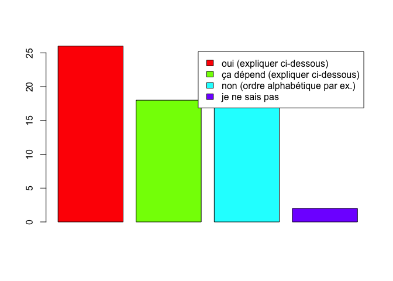

Ce document analyse les réponses des adhérents de la ROADEF au sondage sur les pratiques de publications diffusé par la SIF à l’automne 2018.  Il se focalise sur les différences entre les pratiques décrites pour l’informatique en général et les pratiques décrites par les adhérents ROADEF.

# Comparaison avec le comportement général

##	Importance des revues

Question posée : « Votre objectif est de publier vos résultats plutôt en revue ou dans des actes de conférence ? ».
Globalement, la publication en revue semble avoir plus de poids pour les adhérents ROADEF que pour l’ensemble des répondants au sondage. En effet, 64% des adhérents ROADEF répondent « en revue » alors que pour l’ensemble de l’informatique, la réponse « dans les deux » est largement majoritaire. 

## Ordre des auteurs

2)	Ordre des auteurs

Question posée : « L’ordre des auteurs a-t-il une importance ? »

Pour les adhérents à la ROADEF, l’ordre des auteurs dans une publication a le plus souvent une importance. L’ordre alphabétique ne semble être systématiquement utilisé que pour 25% des répondants. Pour les autres, les pratiques décrites dans les réponses libres indiquent deux logiques :

-	Le doctorant ou le jeune chercheur est placé en premier, suivi de ses encadrants dans l’ordre croissant de séniorité,
-	L’ordre des auteurs suit l’ordre décroissant d’implication dans le travail.

Pour les autres questions, les réponses des adhérents ROADEF ne diffèrent pas de façon significative de l’ensemble des réponses.

# Analyse des canaux de publication

*C'est la partie la plus difficile, et la plus délicate. Les réponses
doivent permettre d'identifier les canaux de publication habituels de
la thématique.*

*Il est aussi nécessaire d'identifier les canaux les plus prestigieux.
Il peut s'agir de conférences ou de revues, cela dépend de la thématique.*

## Canaux extrêmement prestigieux

*Cune seule publication dans ce canal force le respect à l'international*

## Canaux très recherchés

*un senior de premier plan y aura publié*

## Canaux de qualité

*doctorant ou senior, on est fier d'y avoir publié*

## Canaux à destination des doctorants prioritairement

## Canaux d'animation de la communauté

*lieux de rencontre et de réseautage ; préciser français / international*