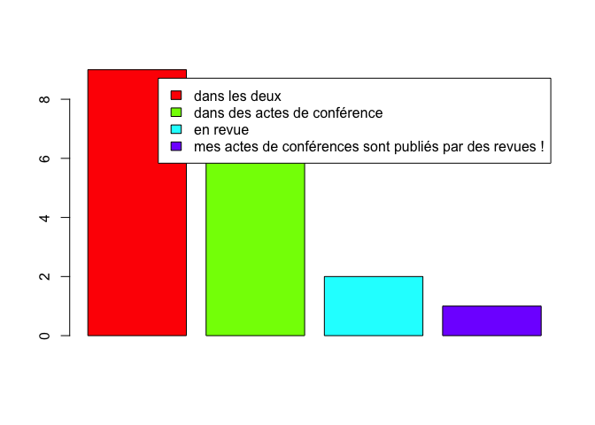
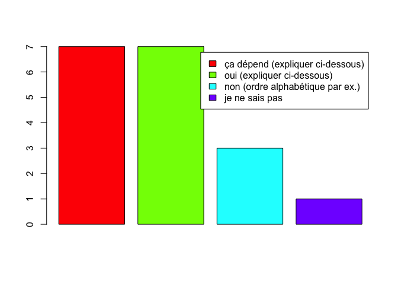
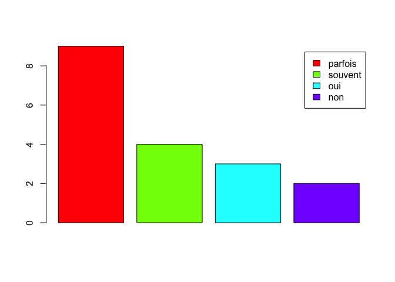

Ce document analyse les réponses des adhérents de la [SSFAM](http://ssfam.org) au sondage de la SIF sur les pratiques de publications diffusé en 2019. Il se focalise sur les différences entre les pratiques décrites pour l’informatique en général et les pratiques décrites par les adhérents de la SSFAM.

# Comparaison avec le comportement général

##	Importance des revues

Question posée : « Votre objectif est de publier vos résultats plutôt en revue ou dans des actes de conférence ? ».
Globalement, la publication en conférences semble avoir plus de poids pour les adhérents de la SSFAM que pour l'ensemble des répondants au sondage. Mais les revues et les conférences sont tous les deux considérés comme medium de publication important.

## Ordre des auteurs

Question posée : « L’ordre des auteurs a-t-il une importance ? »

Pour les adhérents de la SSFAM, l'ordre des auteurs est généralement important. Les pratiques reportées sont variables, mais il ressort que généralement le ou les premiers auteurs sont généralement les étudiants/post-doc/jeune chercheur au coeur des travaux effectués suivis des encadrants ou collaborateurs (souvent en ordre alphabétique). D'autres pratiques mentionnent des ordres relatifs au niveau décroissant d'implication des auteurs. Cette dernière pratique semble avoir pris de l'importance ces derniers années à par le fait que certaines pratiques chez des équipes de recherche de l'industrie notamment (e.g. GAFAM) font apparaitre une liste importante de collaborateurs de l'équipe associée aux travaux.

## Localisation

La localisation d'une conférence peut influencer sur le choix d'y participer. Les avis semblent un peut-être moins forts que dans le sondage général.

# Analyse des canaux de publication

## Note Importante

L'*apprentissage machine* ou *machine learning (ML)* a la particularité d'être un domaine qui se
situe naturellement à la frontière de plusieurs disciplines, son
évolution large et rapide ses dernières années l'a vu se développer au
sein de nouvelles disciplines que ce soit d'un point de vue plus
théorique/fondamental ou applicatif. Il est aujourd'hui difficile de
recenser l'ensemble des canaux pouvant contenir des contributions
significatives en apprentissage et probablement illusoire de pouvoir
le tenir à jour. La SSFAM indique à titre informatif un ensemble de
canaux qui contiennent des contributions significatives pour l'avancée
du domaine de l'apprentissage. Cette liste indicative ne saurait être
pleinement exhaustive ni complètement objective sur la qualité
générale d'un canal de publication. Les choix mentionnés ci-dessous se
focalisent sur l'aspect apprentissage machine selon les réponses fournies par
le sondage de la SIF. 
De plus, il semble important de signaler que dans le domaine de l'apprentissage machine, les conférences sont très importantes et les canaux les plus prestigieux, de part leur processus de relecture et leur niveau de sélection, peuvent être considérés comme ayant une valeur similaire à de très bonnes revues.

## Canaux prestigieux

        Définition : "les canaux de publication les plus prestigieux du domaine :
        - un chercheur de tout premier plan cherchera à y publier ses travaux
        - un résultat publié dans ces canaux sera remarqué par la communauté internationale"

- **Conférences spécifiques ML** : NeurIPS, ICML, COLT
- **Conférences non spécifiques ML** : CVPR, IJCAI, AAAI, ICCV, ACL, SIGIR, KDD, STOC, FOCS, SODA, WSDM
- **Journaux spécifiques ML** : JMLR, 
- **Journaux non spécifiques ML** : Science, Nature

## Canaux recherchés

       Définition : "un chercheur de tout premier plan y aura publié régulièrement"
        "une publication dans ces canaux est un gage de reconnaissance internationale"

- **Conférences spécifiques ML** : AISTATS, ICLR, ECML-PKDD, 
- **Conférences non spécifiques ML** : ECAI, ECCV, EMNLP, IEEE ICDM, 
- **Journaux spécifiques ML** : Machine Learning Journal, Neurocomputing
- **Journaux non spécifiques ML** : IEEE TPAMI, IJCV,  TKDD,  DAMI,  DMKD, Pattern Recognition

## Canaux de qualité

        Définition : "des canaux classiques et de qualité dans le domaine"

- **Conférences spécifiques ML** : IJCNN, ALT, ESANN, ACML 
- **Conférences non spécifiques ML** : PAKDD, NAACL, COLING, SIAM DM, Recsys, ECIR, IDA, S+SSPR, ICPR, IEEE ICIP, ICONIP, ICTAI, ILP, ICDAR, ACCV, ICGI
- **Journaux** : Computer Vision and Image Understanging (CVIU), Theoretical Computer Science (TCS) , Knowledge and Information Systems (KAIS), Pattern Recognition Letters (PRL), Trans on Image Processing (TIP), Information Retrieval Journal (IRJ) , IEEE Transactions on Computational Intelligence and AI in Games (TCIAIG)

## Canaux accessibles

        Définition : "des canaux de publication reconnus par la communauté,
        accessibles, qui permettent de présenter de premiers résultats
        et favoriser les échanges"

- Conférence d'Apprentissage (CAp), 
- Extraction et Gestion des Connaissances (EGC)
- GDR-IA et GDR ISIS
- Société Savante Francophone d'Apprentissage Machine (SSFAM)
- Journées de Statistique (JdS) de la SFdS
- Colloque francophone de traitement du signal et des images (GRETSI)
- Traitement Automatique de la Langue Naturelle TALN et RECITAL
- Journées d'Analyse des Données Textuelles
- COnférence en Recherche d Information et Applications (CORIA)
- Congrès Reconnaissance des Formes, Image, Apprentissage et Perception (RFIAP)
- Journées francophones de programmation par contraintes (JFPC)
...
